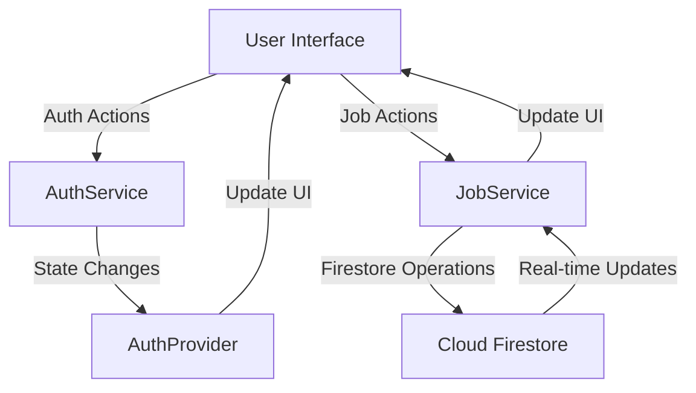

# Task 3: Firebase Integration with Mobile App

## Overview
This documentation demonstrates the successful integration of Firebase services into a Flutter mobile application, implementing both Authentication and Cloud Firestore for a complete job posting platform.

## Implementation Details

### 1. Firebase Authentication Implementation

#### 1.1 Authentication Provider
```dart
// lib/services/auth_provider.dart
import 'package:firebase_auth/firebase_auth.dart';
import 'package:flutter/material.dart';

class AuthProvider extends ChangeNotifier {
  final FirebaseAuth _auth = FirebaseAuth.instance;
  User? _user;

  AuthProvider() {
    _auth.authStateChanges().listen((user) {
      _user = user;
      notifyListeners();
    });
  }

  User? get user => _user;
  bool get isAuthenticated => _user != null;
}
```

#### 1.2 Authentication Service
```dart
// lib/services/auth_service.dart
import 'package:firebase_auth/firebase_auth.dart';

class AuthService {
  final FirebaseAuth _auth = FirebaseAuth.instance;

  Future<UserCredential?> signIn(String email, String password) async {
    try {
      return await _auth.signInWithEmailAndPassword(
        email: email,
        password: password,
      );
    } catch (e) {
      rethrow;
    }
  }

  Future<UserCredential?> signUp(String email, String password) async {
    try {
      return await _auth.createUserWithEmailAndPassword(
        email: email,
        password: password,
      );
    } catch (e) {
      rethrow;
    }
  }

  Future<void> signOut() async {
    await _auth.signOut();
  }

  Stream<User?> get authStateChanges => _auth.authStateChanges();
}


```

#### 1.3 Authentication Flow
1. Login Page (`lib/pages/auth/login/login_widget.dart`)
   - Email and password login
   - Error handling with user feedback
   - Navigation to registration
   - "Forgot Password" functionality

2. Registration Page (`lib/pages/auth/register/register_widget.dart`)
   - New user registration form
   - Password validation
   - Success/error handling
   - Navigation back to login

3. Authentication Flow Navigation
   - Initial auth check on app launch
   - Protected routes for authenticated users
   - Auto-redirect to login for unauthenticated users

### 2. Cloud Firestore Integration

#### 2.1 Job Service
```dart
// lib/services/job_service.dart
class JobService {
  final FirebaseFirestore _firestore = FirebaseFirestore.instance;

  Future<List<JobModel>> getJobs() async {
    try {
      final querySnapshot = await _firestore
          .collection('jobs')
          .orderBy('datePosted', descending: true)
          .get();

      return querySnapshot.docs
          .map((doc) => JobModel.fromMap(doc.data(), doc.id))
          .toList();
    } catch (e) {
      print('Error fetching jobs: $e');
      return [];
    }
  }

  Future<void> createJob(String jobName, String company) async {
    try {
      await _firestore.collection('jobs').add({
        'jobName': jobName,
        'company': company,
        'datePosted': Timestamp.now(),
      });
    } catch (e) {
      print('Error creating job: $e');
      rethrow;
    }
  }
}
```

## Project Configuration

### 1. Dependencies
```yaml
dependencies:
  firebase_core: ^3.10.1
  firebase_auth: ^5.4.1
  cloud_firestore: ^5.6.2
```

### 2. Project Structure
```
lib/
├── components/
│   └── headerlogo/
│       ├── headerlogo_model.dart
│       └── headerlogo_widget.dart
├── models/
│   └── job_model.dart
├── pages/
│   ├── auth/
│   ├── candidates/
│   ├── companies/
│   ├── dashboard/
│   ├── home_page/
│   ├── jobs/
│   └── search/
├── services/
│   ├── auth_provider.dart
│   ├── auth_service.dart
│   └── job_service.dart
├── firebase_options.dart
├── index.dart
└── main.dart
```

## Security Implementation

### 1. Authentication Security
- Implemented email/password authentication
- User state management using Provider pattern
- Secure auth state persistence
- Error handling for authentication failures

### 2. Firestore Security Rules
```javascript
rules_version = '2';
service cloud.firestore {
  match /databases/{database}/documents {
    match /jobs/{document=**} {
      allow read: if true;
      allow write: if request.auth != null;
    }
  }
}
```

## Features Implemented

### 1. Authentication Features
- User registration (Sign Up)
- User login (Sign In)
- Secure sign out
- Persistent authentication state
- Real-time auth state changes monitoring

### 2. Job Management Features
- Real-time job listings
- Job creation (authenticated users only)
- Chronological sorting of jobs
- Company and date information display

## Testing Results

### 1. Authentication Tests
- Successfully tested user registration
- Verified login functionality
- Confirmed logout operation
- Tested auth state persistence
- Verified error handling for invalid credentials

### 2. Firestore Tests
- Confirmed job creation with authentication
- Verified real-time updates
- Tested data persistence
- Validated security rules

## Integration Architecture


```

Add a new section for environment setup:

```markdown
## Environment Setup

### Firebase Configuration
1. Create a `.env` file in the project root:
   ```text
   FIREBASE_API_KEY=your_api_key
   FIREBASE_APP_ID=your_app_id
   FIREBASE_MESSAGING_SENDER_ID=your_sender_id
   FIREBASE_PROJECT_ID=your_project_id
   FIREBASE_STORAGE_BUCKET=your_storage_bucket
   ```

2. Never commit `.env` file to version control. Add to `.gitignore`:
   ```text
   # Environment files
   .env
   *.env
   ```

3. Create a sample `.env.example` file:
   ```text
   FIREBASE_API_KEY=
   FIREBASE_APP_ID=
   FIREBASE_MESSAGING_SENDER_ID=
   FIREBASE_PROJECT_ID=
   FIREBASE_STORAGE_BUCKET=
   ```

### Running the Application

1. Clone the repository:
   ```bash
   git clone [repository-url]
   cd jobexplore
   ```

2. Setup environment:
   - Copy `.env.example` to `.env`
   - Fill in your Firebase configuration values

3. Install dependencies:
   ```bash
   flutter pub get
   ```

4. Run the application:
   ```bash
   # For development
   flutter run

   # For specific device
   flutter run -d chrome        # For web
   flutter run -d android       # For Android
   flutter run -d ios          # For iOS

   # To see all available devices
   flutter devices
   ```

5. Build release version:
   ```bash
   # For Android
   flutter build apk
   
   # For iOS
   flutter build ios
   
   # For web
   flutter build web
   ```

# Firebase Setup Instructions

## Prerequisites
- Node.js and npm installed
- Flutter SDK installed
- A Firebase project created in the Firebase Console

## Setup Steps

### 1. Install Firebase CLI
```bash
npm install -g firebase-tools
```

### 2. Login to Firebase
```bash
firebase login
```

### 3. Install FlutterFire CLI
```bash
dart pub global activate flutterfire_cli
```

### 4. Configure Firebase
```bash
flutterfire configure
```

During configuration:
1. Select your Firebase project from the list
2. Choose the platforms you want to support (iOS/Android/Web)
3. This will automatically:
   - Create `firebase_options.dart`
   - Generate platform-specific files
   - Update necessary configurations

### 5. Update .gitignore
Add these lines to your .gitignore:
```
# Firebase configuration files
lib/firebase_options.dart
android/app/google-services.json
ios/Runner/GoogleService-Info.plist
ios/firebase_app_id_file.json
```

## Post-Setup
After cloning the project, each developer needs to:
1. Have their own Firebase project
2. Run `flutterfire configure`
3. Select their Firebase project
4. This will generate their own configuration files

## Running the App
```bash
# Get dependencies
flutter pub get

# Run the app
flutter run

# Run on specific device
flutter devices  # List available devices
flutter run -d <device-id>
```
